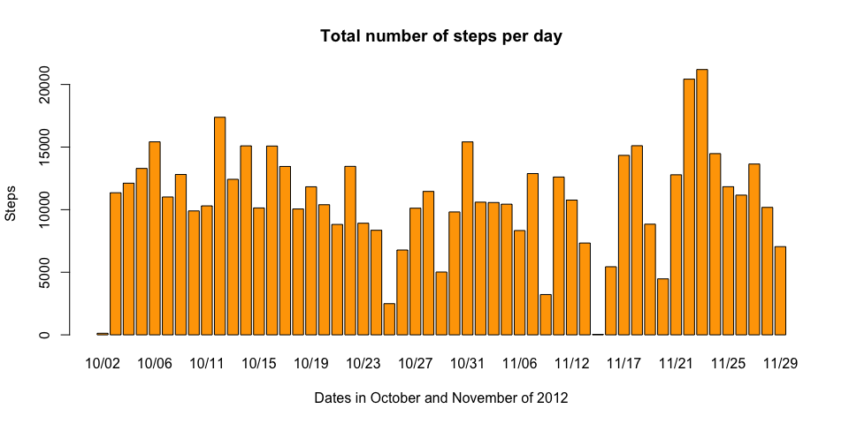
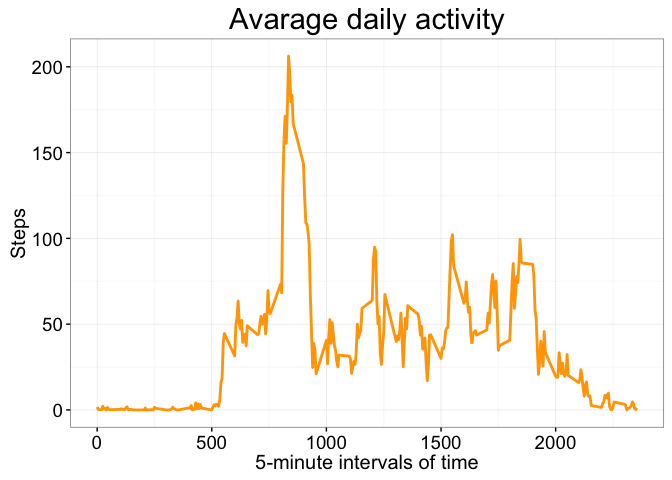
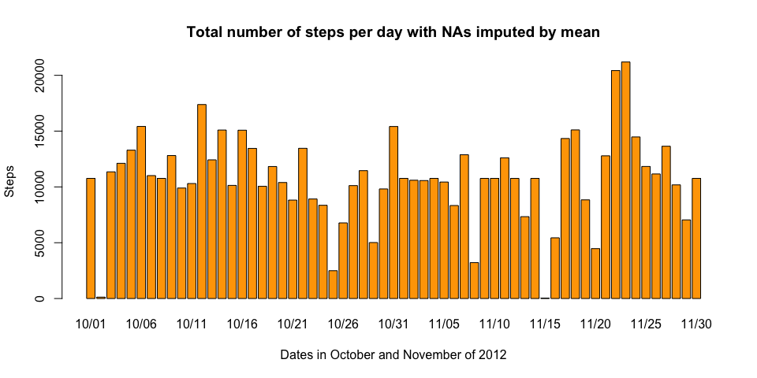
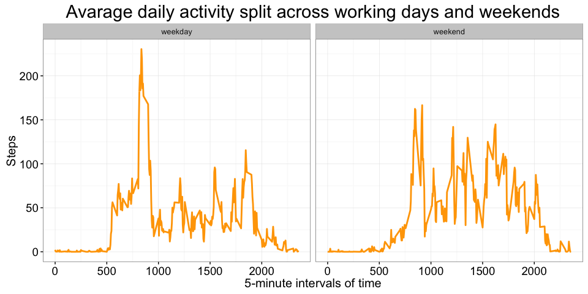

# Reproducible Research: Peer Assessment 1

## Loading and preprocessing the data

With *activity.zip* given we can unpack and load working data. We want to add a new column -- weekday, that will be using later on. Also let's remove year from the date values (since it's always 2012) to make it compact when using in plots.


```r
library(ggplot2)
library(plyr)

if ( ! file.exists('activity.csv') ) { unzip(activity.zip) }
activity <- read.csv("activity.csv", na.strings="NA")

activity$weekday <- weekdays(as.Date(activity$date))
levels(activity$date) <- sub('2012-([10]{2})-', '\\1/', levels(activity$date))
```

## What is mean total number of steps taken per day?

Let's take a look at how much steps are taken per day. First we want to sum number of steps for each date in the dataset.


```r
activity.total <- aggregate(steps ~ date, activity, sum, na.action = na.omit)
```

Then let's put it in a histogram to make the figures more verbose.


```r
barplot(activity.total$steps, names.arg = activity.total$date, 
        main = 'Total number of steps per day',
        xlab = 'Dates in October and November of 2012',
        ylab = 'Steps',
        col = 'orange')
```

 

Below is a summary statistics for totals number of steps taken each day. It includes mean and median.


```r
summary(activity.total$steps)
```

```
##    Min. 1st Qu.  Median    Mean 3rd Qu.    Max. 
##      41    8841   10760   10770   13290   21190
```

## What is the average daily activity pattern?

Let's take a look at avarage daily activity at certain time intervals across the whole period. That will give us a sense of a typical dayly activity pattern.


```r
activity.avg <- aggregate(steps ~ interval, activity, mean, na.action = na.omit)
ggplot(activity.avg, aes(interval, steps)) + 
  geom_line(aes(group=1), size = 1, colour = 'orange') +
  labs(
    title = 'Avarage daily activity',
    x = '5-minute intervals of time',
    y = 'Steps') +
  theme_bw() +
  theme(
    plot.title = element_text(size=22),
    axis.text=element_text(size=14),
    axis.title=element_text(size=15))
```

 

As we can see there are some peaks in activity on average across all the days. The most active 5-minute interval is 835.


```r
activity.avg[which.max(activity.avg$steps),]
```

```
##     interval    steps
## 104      835 206.1698
```

## Imputing missing values

We have 2304 NA values in total.


```r
sum(is.na(activity$steps))
```

```
## [1] 2304
```

Let's get rid of NAs by populating them with values from *activity.avg* data frame for particular time interval. To recap, the data frame contains mean of steps for specific 5-minute interval accross the whole period of time.


```r
activity.impute <- activity
activity_na_values <- which(is.na(activity.impute$steps))

for(index in activity_na_values) {
  # find interval in activity.avg that matches current one with NA value
  current_interval <- activity.avg$interval == activity.impute[index,]$interval
  
  activity.impute[index,]$steps <- activity.avg[current_interval,]$steps
}
```

And now we can take a look at the same histogram of total number of steps, but with NA imputed by the mean value (for that particular 5-minute interval) for all days.


```r
impute_total <- aggregate(steps ~ date, activity.impute, sum)
barplot(impute_total$steps, names.arg = impute_total$date, 
        main = 'Total number of steps per day with NAs imputed by mean',
        xlab = 'Dates in October and November of 2012',
        ylab = 'Steps',
        col = 'orange')
```

 

As we can see generaly the curve didn't change since we updated the data set, so the NA values don't impact the big picture very much. 

We can see some small difference though. It's new bars appeared in the plot (like the one for very first date 10/01). Looks like at these days no measurement took place and now we made them show up.

## Are there differences in activity patterns between weekdays and weekends

Let's first change the *activity.impute$weekday* to reflect weekends and working days.


```r
activity.impute <- mutate(activity.impute, 
  weekday = ifelse(weekday == 'Saturday' |  weekday == 'Sunday', 'weekend', 'weekday'))
activity.impute$weekday <- as.factor(activity.impute$weekday)
```

And second, let's show it on a plot


```r
impute_average <- aggregate(steps ~ interval + weekday, activity.impute, mean)
ggplot(impute_average, aes(interval, steps)) + 
  facet_wrap(~weekday) +
  geom_line(aes(group=1), size = 1, colour = 'orange') +
  labs(
    title = 'Avarage daily activity split across working days and weekends',
    x = '5-minute intervals of time',
    y = 'Steps') +
  theme_bw() +
  theme(
    plot.title = element_text(size=22),
    axis.text=element_text(size=14),
    axis.title=element_text(size=15))
```

 

